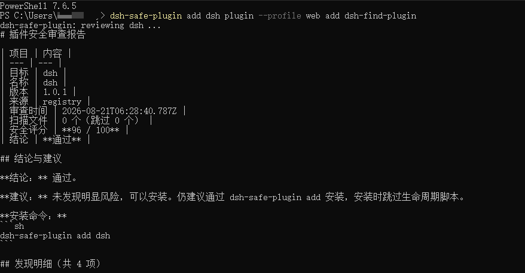
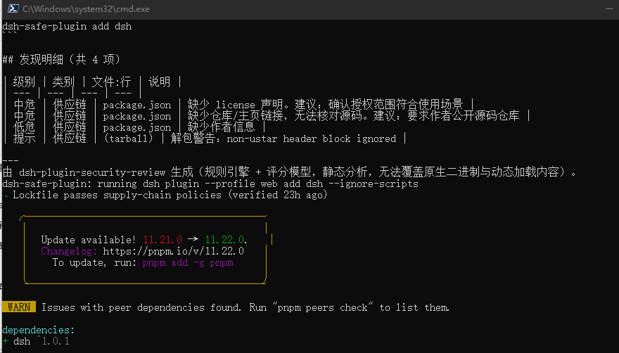
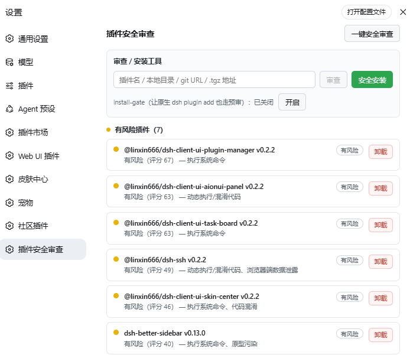

# dsh-plugin-security-review 使用说明

面向 DeepSeek Harness（dsh）的**插件安全审查插件**：安装后，再安装任何其他插件前先做静态安全审查（识别危险代码、漏洞与供应链风险），并在运行期持续审计已安装插件，输出安全报告与安装建议。

**版本**：0.1.0（MIT）　**仓库**：https://github.com/ateen18/dsh-plugin-security-review

---

## 1. 功能总览

| 入口 | 能力 |
| --- | --- |
| **CLI：`dsh-safe-plugin`** | 安装前预审（审查→判定→拦截/放行后转发安装）；只审查；历史报告；复审已装插件；install-gate 手动管理 |
| **Web 设置页「插件安全审查」** | 全部插件一览（含官方内置，内置免审）；一键审查；按风险分组折叠（危险/风险展开、安全折叠）；彩色圆点；与结论对齐的直观风险描述；一键卸载；错误重试 |
| **会话内工具** | `security_review`（审查任意目标）、`security_review_status`（已装插件审查状态） |
| **运行期门禁** | 启动后全量审计（带缓存）；对后续动态挂载的插件在 import 前拦截（block 以空实现替代，不执行其代码）；`dshInstallRoot` 解析失败时自动收窄审查范围（只审 profile 内包）并放行未知目标 |

## 2. 安装

### 2.1 安装本插件

```sh
# 方式一：npm registry
dsh plugin --profile web add dsh-plugin-security-review

# 方式二：GitHub 仓库（无需发布 npm；会自动 clone 仓库）
dsh plugin --profile web add github:ateen18/dsh-plugin-security-review

# 方式三：本地开发（link: 方式，改动即时生效）
dsh plugin --profile web add link:<你的插件源码目录>

# 方式四：安全安装器（先自审再安装；需先让 CLI 可用，见 2.2）
dsh-safe-plugin add dsh-plugin-security-review
```

> **依赖说明**：本插件声明的 `@deepseek-ai/*`（cordis-plugin-loader / dsh-settings / dsh-tools / schemastery）均为 **optionalDependencies**——registry 装不上不会导致安装失败；运行时优先从 dsh 安装目录解析宿主自身的副本（保证类实例一致），装进 profile 的副本仅作兜底。

### 2.2 让 CLI 可用（三种任选）

```sh
# ① 全局安装（bin 进入 PATH）
npm i -g dsh-plugin-security-review

# ② 用 profile 内生成的 bin（pnpm 为带 bin 的依赖建 shim）
& "$env:USERPROFILE\.dsh\profiles\web\node_modules\.bin\dsh-safe-plugin.cmd" --help

# ③ 直接以 node 运行
node "<你的插件源码目录>/lib/cli/index.js" --help
```

### 2.3 卸载本插件

```sh
dsh plugin --profile web remove dsh-plugin-security-review
```

## 3. 安装其他插件前：预审（推荐用法）

```sh
# 审查 + 安装：
#   pass  → 直接放行（自动附加 --ignore-scripts，不执行安装脚本）
#   warn  → 交互确认 [y/N]（CI 用 --yes 跳过）
#   block → 拒绝安装（退出码 2；--force 强制放行，风险自担）
dsh-safe-plugin add dsh-plugin-foo
dsh-safe-plugin add ./本地插件目录
dsh-safe-plugin add https://github.com/me/plugin.git

# 只审查不安装（--json 输出机器可读报告；--ignore <pattern> 可跳过目录）
dsh-safe-plugin review dsh-plugin-foo
dsh-safe-plugin review . --ignore test/fixtures

# 历史报告 / 复审已装插件
dsh-safe-plugin list
dsh-safe-plugin verify [包名]
```





> 说明：`dsh plugin add` **默认不经过预审**（installGate 默认关闭，避免改写全局 dsh 文件）；想让原生命令也走审查，见第 7 节 installGate。

## 4. Web 设置页：插件安全审查

路径：**设置 → 左侧栏「插件安全审查」**。

### 4.1 界面说明

- **一键安全审查**：对当前全部已加载插件执行完整静态审查（带缓存，重复点击秒回；审查中显示「审查中…」）；
- **审查 / 安装工具**（可视化替代终端 CLI）：
  - 输入目标（插件名 / 本地目录 / git URL / .tgz 地址）→ 「审查」：实时审查并显示结论、评分与风险摘要；
  - 「安全安装」：先审查，pass 直接安装（自动 `--ignore-scripts`），warn/block 显示风险并给出「确认风险并强制安装」按钮，安装完成后提示重启生效；
  - **install-gate 开关**：一键开启/关闭「原生 `dsh plugin add` 也走预审」（高危操作，默认关闭，切换前二次确认）。
- **分组列表**（按风险分组，空组不渲染）：
  - 🔴 **危险插件**（block）：直接展开显示，附卸载按钮；
  - 🟡 **有风险插件**（warn）：直接展开显示，附卸载按钮；
  - 🟢 **安全插件**（pass/audit/内置/未审查）：默认折叠，点「▸ 展开」查看，再点「▾ 收起」；
- **每行内容**：彩色圆点（🟢安全 / 🟡有风险 / 🔴危险 / 灰=内置或未审查）+ 包名与版本 + 一句话风险描述 + 卸载按钮；
- **卸载**：仅非官方插件可卸载；点击后 `confirm` 确认 → 从 profile 依赖移除（`pnpm remove`）→ 提示「重启后完全生效」；
- **错误重试**：接口请求失败时显示错误信息与「重试」按钮（例如 host API 尚未注册完成时）。

> 官方内置插件（dsh 自带的 bundle）灰显「内置插件」，免审、不可卸载。



### 4.2 风险描述与结论的关系（重要）

风险描述与结论**语义对齐**：

| 结论 | 描述示例 |
| --- | --- |
| 安全（pass） | `安全（评分 92）`；若存在中低危提示：`安全（评分 89）（存在 3 条中低危提示，详见报告）`——**不罗列具体风险词** |
| 有风险（warn） | `有风险（评分 46）— 浏览器端数据泄露、动态执行/混淆代码`（只列 critical/high） |
| 危险（block） | `危险（评分 30）— 硬编码密钥（API 密钥泄露）、凭据/数据外传` |
| 仅审计 / 内置 / 未审查 | `仅审计（评分 X）` / `dsh 内置插件，无需审查` / `尚未审查，点击上方按钮执行一键审查` |

即：**「安全」= 无高危信号，不代表零发现**；中低危提示归入括号说明，完整明细请看 Markdown 报告。

## 5. 会话内工具

模型在会话中可直接调用：

- **`security_review(target, fresh?)`**：审查本地目录 / npm 包（可带 @版本）/ git URL / tgz 地址，返回完整报告（评分、逐条发现、结论、安装建议）与 Markdown；
- **`security_review_status(profile?, fresh?)`**：当前 profile 已装插件的审查状态总览（结论/评分/发现数/是否被拦截）。

## 6. 报告与结论解读

### 报告存储

```text
$DSH_HOME/security-review/
├── cache/                  # 审查缓存（按包身份哈希 + 规则版本，变更自动失效）
├── reports/latest/<包名>.md      # 最新 Markdown 报告
├── reports/history/              # JSON 历史报告
└── index.json                    # 索引
```

### 结论与评分

| verdict | 含义 | 对应动作 |
| --- | --- | --- |
| `pass` | 未发现高危风险 | 可以安装（仍建议跳过安装脚本） |
| `warn` | 存在需人工确认的高危发现 | 谨慎安装；审查后可放行 |
| `block` | 存在严重/高危风险信号 | 不建议安装/建议卸载 |
| `audit` | 仅审计模式 | 只记录，不拦截 |

评分 0–100；`standard` 策略下：存在 critical → block，评分 <30 → block，存在 high → warn，评分 <60 → warn；`strict` 下 high 也 block。

### 风险短语速查（UI 摘要/报告提炼）

| 短语 | 对应规则 |
| --- | --- |
| 安装脚本自动执行 / 下载后执行恶意脚本 | install-script、download-exec |
| 执行系统命令 | danger-child-process |
| 动态执行/混淆代码 | dynamic-eval、obfuscation |
| 远程代码加载 | remote-code-load |
| 凭据/数据外传 | data-exfil |
| 硬编码密钥（API 密钥泄露） | hardcoded-secret |
| 读写用户文件 | unsafe-fs |
| 原生二进制（无法静态审查） | native-binary |
| 原型污染 | prototype-pollution |
| 可疑包名（疑似钓鱼）/ 可疑依赖 | typosquat、suspicious-deps |
| 明文网络通信 | plain-http（跳过文档文件与 example.com 等示例域名） |
| 可操控插件清单 | dsh-host-abuse |
| 浏览器端数据泄露 | client-browser-risk |
| 加密货币地址/挖矿载荷 | miner-wallet（low 级提示，跳过文档文件） |
| 安装包完整性校验失败 | integrity-mismatch |

> 注：`weak-metadata`（缺 license/仓库）属包健康度提示，出现在完整报告中，不进入 UI 风险摘要。

## 7. 策略设置（设置页 → security-review）

| 字段 | 默认 | 说明 |
| --- | --- | --- |
| `policy` | `standard` | `standard`：critical→block；`strict`：high 也 block；`audit-only`：只记录不拦截 |
| `autoDisable` | `false` | **默认只报告不自动禁用**（稳定性优先：防止误伤合法插件或运行中卸载服务导致 dsh 崩溃）；开启后，运行期审计发现 block 才禁用该插件 |
| `autoPatchProfile` | `false` | 默认不写 profile `cordis.patch.yml` 托管块；开启后，被拦截插件下次启动不再加载其代码 |
| `installGate` | `false` | 是否让原生 `dsh plugin add` 也走预审。开启后改写全局 dsh `lib/bin.js` 注入审查钩子（**高危操作**，默认关闭）——**方案 B 实现**：低频注入（已生效不重写）、原子写入 + node --check 语法自检（失败回滚）、插件不可用时自清理；也可用 CLI 手动管理（见下） |
| `runtimeGuard` | `off` | 运行时工具调用守卫：`off` 不启用；`log` 只记录危险调用（破坏性命令/下载执行/SSRF/敏感凭据文件/提示词注入）；`block` 直接拒绝危险调用（fail-open） |
| `allowlist` | `[]` | 豁免名单（包名；`*` 全部豁免） |

### installGate 手动管理（可选）

```sh
dsh-safe-plugin install-gate [--dsh-root <dir>]      # 注入（幂等，已生效则跳过写入）
dsh-safe-plugin uninstall-gate [--dsh-root <dir>]    # 移除注入，恢复 dsh 原状
```

> 默认行为：`installGate=false` 时，若检测到历史残留注入会自动移除（恢复全局 dsh 原状）。

## 8. 稳定性保障（本插件不会弄坏 dsh）

1. **模块图零外部依赖**：`@deepseek-ai/*` 全部经 `host.js` 从 dsh 安装目录**惰性**加载——插件 entry 加载不依赖任何外部包，不存在「顶层 import 失败 → dsh 启动失败」的路径；
2. **apply 全程异常隔离**：任何内部异常只打日志，绝不让插件 entry 失败导致 dsh 启动失败；
3. **门禁 fail-open**：import 门禁对解析/判定异常一律放行；审查器运行失败降级为 warn 报告；
4. **审查范围自动收窄**：`dshInstallRoot` 解析失败（dsh 安装方式特殊）时，只审 profile 目录内的包，**不会误审/误伤官方插件**（防止 agent 工具缺失）；
5. **install-gate 默认关闭**，写入原子化 + 语法自检 + 自清理，失败不影响 dsh 任何功能。

## 9. 常见问题（FAQ）

### Q1：设置页「插件安全审查」显示 HTTP 404？
重启 dsh 后应自动恢复（host API 等待 webServer 就绪后注册，最长 8 秒）。仍 404 时：看 dsh 终端日志是否有 `设置 API 注册失败`；点界面「重试」；刷新页面。

### Q2：日志在哪里看？
dsh 的日志实时打印在**启动 dsh 的终端窗口**（stdout/stderr），没有独立日志文件。找不到窗口可用 `npx @deepseek-ai/dsh web *> dsh.log 2>&1` 重定向后 `Get-Content dsh.log -Wait` 跟踪；浏览器侧用 F12 Console/Network。

### Q3：从 GitHub 安装后 dsh 崩溃 / agent 对话异常？
先确认安装的是**最新版**（`git pull` 后重新 push 再重装）。若仍异常，把启动 dsh 终端中 `security-review` / `plugin tree failed to load` / `ERR_MODULE_NOT_FOUND` / `SyntaxError` 相关报错原样发回。本插件已消除已知路径：rc 依赖改为 optionalDependencies（装不上不失败）、模块图零外部依赖、scope 收紧防误伤官方插件。

### Q4：卸载按钮点了没反应 / 说要重启？
卸载 = `pnpm remove` 从 profile 依赖移除，运行中的插件实例要**重启 dsh** 才完全生效（UI 会提示）。官方插件不可卸载（无按钮）。

### Q5：审查结果会不会误报？
`block` 是「存在强风险信号」，不是「证明恶意」；静态分析无法覆盖原生二进制、运行时下载代码、强混淆载荷。已知误报点已收紧（miner-wallet / plain-http / weak-metadata）。疑似误报可在 `allowlist` 中豁免，或人工审查报告后放行。

### Q6：headless 等其他 profile 能用吗？
可以。审计/工具/CLI 与 profile 无关；Web 设置页与 `/api` 仅 web profile 有（无 webServer 时自动跳过注册）。

### Q7：改了插件源码后界面没变化？
`link:` 安装下 host 改动重启即生效；**client bundle 改动需要浏览器硬刷新（Ctrl+F5）**，或重启 dsh 后由 `/plugins` 服务重新提供。

## 10. 已知限制（诚实声明）

1. 静态分析覆盖范围有限：原生二进制、运行时下载的代码、强混淆载荷无法被静态审查覆盖；
2. 传递依赖（插件声明的第三方依赖）只做名称层面可疑检测，不做逐文件扫描；
3. 运行期门禁对本插件 apply 之后的插件 import 有确定性拦截；同批次更早启动的插件在首次启动的毫秒级窗口内先加载，随后被启动审计覆盖（默认只报告）；
4. 若某插件是其他插件 `inject` 的服务提供方，`autoDisable` 开启后被禁用会导致启动时缺服务失败（dsh fail-loud 契约），报告会指明缺哪个服务；
5. `dshInstallRoot` 解析失败时审查范围收窄为 profile 内包（稳定性优先）；
6. 客户端为手写 ModuleLoader bundle，未经构建器校验——若设置页入口/交互异常，优先看浏览器 Console 与 dsh 终端日志。

## 11. 开发者

```sh
# 获取源码（任意路径）并进入目录：
#   git clone https://github.com/ateen18/dsh-plugin-security-review && cd dsh-plugin-security-review
cd <你的插件源码目录>
npm test             # 行为测试（44 用例）
npm run check        # 全量语法校验（node --check 真实解析器）
```

### 目录结构

```text
lib/
├── index.js          宿主插件（审计、设置区、工具、webServer API 注册、watcher）
├── api.js            HTTP API（list/run/uninstall，loopback 防护）
├── client.js         浏览器端设置页模块（ModuleLoader bundle，含加载器降级保护）
├── gate.js           import 门禁（EntryTree.prototype.import 补丁 + 作用域判定 + fail-open）
├── host.js           dsh 宿主包解析（从 dsh 安装目录惰性加载 @deepseek-ai/*）
├── install-gate.js   原生 dsh plugin add 预审钩子（低频注入 + 原子写 + 自检 + 自清理）
├── watcher.js        profile package.json 变更监听（pnpm 直装兜底）
├── store.js          报告/缓存持久化
├── patch-manager.js  profile cordis.patch.yml 托管拦截块
├── settings.js       设置区 schema 与接线
├── tools.js          会话内工具（security_review / security_review_status）
└── analyzer/         纯静态分析器（零依赖）
    ├── rules.js      规则引擎（20 组规则）
    ├── score.js      评分、结论、策略、RISK_LABELS 与风险摘要（与结论对齐）
    ├── tar.js        tgz 解包（防路径穿越/zip bomb）
    ├── registry.js   registry 元数据/版本选择/tarball 完整性校验
    ├── semver.js     极简 semver
    ├── known.js      知名包名清单（typosquat 比对）
    └── render.js     Markdown 报告渲染
docs/                设计文档、使用说明与修复/优化记录
test/                node --test 测试与恶意/良性夹具
```

# 使用者：
npm i -g dsh-plugin-security-review
dsh plugin --profile web add dsh-plugin-security-review
dsh-safe-plugin add dsh-plugin-security-review
```

GitHub：`https://github.com/ateen18/dsh-plugin-security-review`（MIT）。